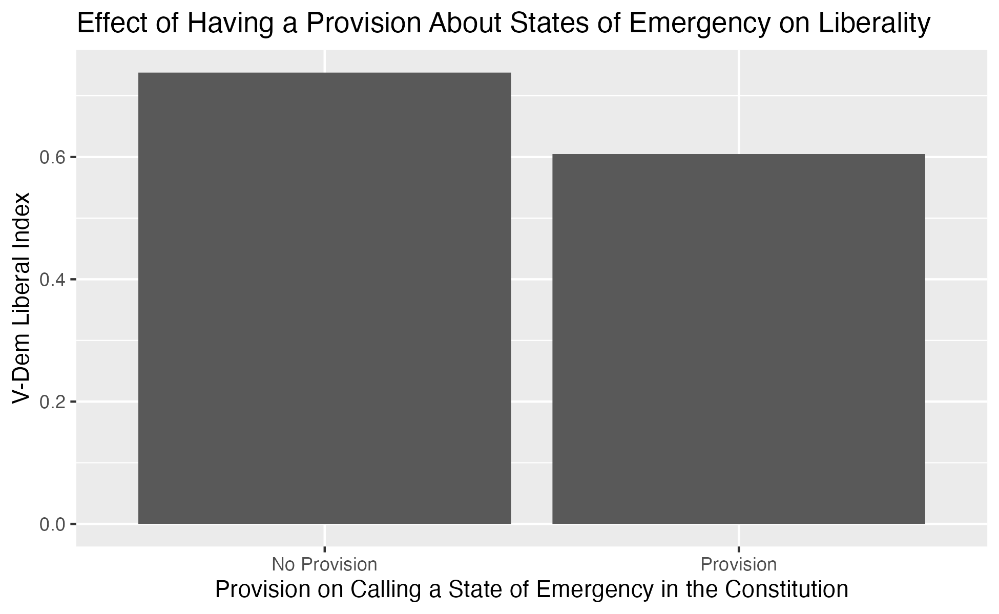
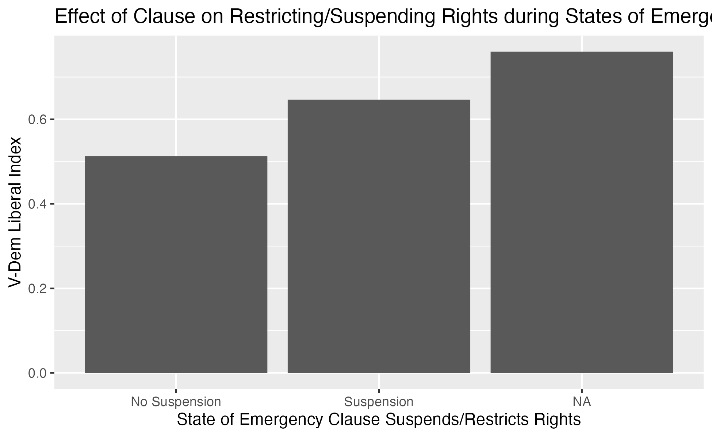

## Project thoughts

Milestone 1:
I want to dive into data from a recent federal election, probably related to  House of Representatives races and compare polls leading up to the election with the actual results. I want to combine US Census data with polling to create a large dataset of demographic, economic, or geographic variables. Then I want to investigate if trends in these variables make polls accurate or inaccurate at predicting election outcomes.

Milestone 2:
Research Question: How did percentage of workers in the manufacturing sector, unemployment, and percent of households making under $15,000 a year affect the accuracy of polls in the 2016 Presidential election? Polls put Hillary Clinton ahead of Donald Trump and while he did not win the popular vote, he did win far more votes than expected due to the undercounting of voters. I want to explore how variables such as rural poverty, loss of manufacturing jobs, and unemployment—issues Trump emphasized—affected how accurate polls were for the 2016 Presidential Election. I hypothesize states with a higher manufacturing share, higher unemployment, and high proportions of poor households increases discrepancies between predicted and actual vote shares in FiveThirtyEight’s model. The explanatory variables are from a table on the US Census website that measure a variety of different economic variables. These are extremely recent and accurate as the Census reaches the vast majority of the US population. The outcome variable is the predicted popular vote for Trump by FiveThirtyEight (measured by aggregating many polls together) minus the final results of the popular vote by state. Each variable will be measured separately. A positive relationship between the variables and poll error with low standard deviation will support my hypothesis whereas a weak relationship or opposite relationship will disprove my hypothesis. 

Unfortunately at this time I have been unable to find FiveThirtyEight’s predicted popular vote share for 2016. I have found this dataset for 2020 on GitHub but a study of those results would be far less interesting as pollsters probably adjusted to polling for Trump between 2016 and 2020.


Demographic data: https://data.census.gov/cedsci/table?q=employment%20statistics&g=0100000US,%240400000&tid=ACSDP1Y2021.DP03&moe=false&tp=true

Election Polls: *need to find 2016 version
https://github.com/fivethirtyeight/data/tree/master/election-forecasts-2020 ->
https://projects.fivethirtyeight.com/2020-general-data/presidential_poll_averages_2020.csv

Election Results:
https://www.fec.gov/resources/cms-content/documents/federalelections2016.pdf

Milestone 3: 
I have completely pivoted to a new topic. Now I am investigating constitutional emergency powers enumeration and how it affects government liberality in the Post-Cold War world. So far I have created two graphs. See below.

Milestone 4: Topic Update:
My project focuses on constitutional provisions on states of emergency and they affect liberal principles such as tyranny of the state, tyranny of the majority, strong rule of law, protection of civil liberties an independent, judiciary, and effective checks and balances. I am most interested in whether or not having a state of emergency clause changes the liberal score and whether or not that state of emergency suspends or restricts rights changes the liberal score.

Hypothesis: 
1. Clausses allowing for states of emergency decrease liberal democracy,
Clauses that restrict or suspend rights during states of emergencies decrease liberal democracy.

Results: see tables at the bottom


---
title: "Constitutions"
output:
  pdf_document: default
  html_document: default
date: "2022-10-30"
---


## R Markdown

```{r}
library(tidyverse)
library(dplyr)
library(infer)
library(stringr)
library(broom)

```

```{r}
constitution <- read_csv("ccpcnc_v4_small.csv")
```


```{r}
constitution <- constitution |>
  drop_na(em) |>
  select(country, year, em, emrights, emdecl) |>
  filter(year > "1991")
```

```{r}
liberal <- read_csv("V-Dem.csv")
```

```{r}
liberal <- liberal |>
  select(country_name, year, v2x_liberal, v2mecenefm, 
         v2mecenefi, v2mecrit, v2mebias) |>
  filter(year > "1991")
```

Finding differences in country names to prevent errors in `inner_join`
```{r}
#unique(liberal$country_name)
#unique(constitution$country)
```

Renaming Variables


```{r}
liberal <- liberal |>
  rename(country = country_name)
```


Using Stingr to standarize country names:


```{r}
library(tidyverse)
library(dplyr)
library(stringr)
liberal <- liberal |>
  mutate(across('country', str_replace, 'Burma/Myanmar', 'Myanmar'),
         across('country', str_replace, 'The Gambia', 'Gambia'),
         across('country', str_replace, 'Republic of the Congo', 'Congo'))

liberal
```


##Filtering out duplicate data in constitution

```{r}
##This filters out all Serbia data, why isn't the "and" function (&) not working
constitution <- constitution |>
  filter(country != "Serbia" & year != "2006")  

```


## Left Join


```{r}
joined <- constitution |>
  left_join(liberal) |>
  select(country, year, v2x_liberal, em, emrights, emdecl) 
```


Importing better names for variable outcomes


```{r}
joined <- joined |>
  mutate(emdecl = case_when(
    emdecl == 1 ~ "Head of State",
    emdecl == 2 ~ "Head of Government",
    emdecl == 3 ~ "Head of State or Head of Gov",
    emdecl == 4 ~ "Gov/Cabinet",
    emdecl == 5 ~ "1st Legislative Chamber",
    emdecl == 6 ~ "2nd Legislative Chamber",
    emdecl == 7 ~ "Both Chambers",
    emdecl == 90 ~ "Left to law",
    emdecl == 96 ~ "Other",
    emdecl == 97 ~ "Unknown",
    emdecl == 98 ~ "Not Specified",
    emdecl == 99 ~ "Not Applicable"
  ))

```

##Does this have an effect?


Checking to see if who authorizes states of emergencies according to the constitution affects liberality. The results are not very interesting, perhaps this could be an interesting cofounder?


```{r}
target_data <- joined |>
  group_by(emdecl) |>
  summarize(mean_liberal = mean(v2x_liberal, na.rm = TRUE)) #|>
  #pivot_wider(names_from = emdecl, values_from = mean_liberal)  
target_data
```


## Mutating Provision on State of Emergency Variable (em)


```{r}
joined <- joined |>
  mutate(em = case_when(
    em == 1 ~ "Provision",
    em == 2 ~ "No Provision",
    em == 96 ~ "Other",
    em == 97 ~ "unknown")
      )
```


```{r}
provision_emerg <- joined |>
  group_by(em) |>
  summarize(mean_liberal = mean(v2x_liberal, na.rm = TRUE)) |>
  filter(!row_number() %in% (2))
provision_emerg
```


## Provision (em) Barplot


```{r}
provision_barplot <- provision_emerg |>
  ggplot(aes(x = em, y = mean_liberal)) +
  geom_bar(stat = "identity") +
  labs(x = "Provision on Calling a State of Emergency in the Constitution", 
       y = "V-Dem Liberal Index",
       title = "Effect of Having a Provision About States of Emergency on Liberality") 
ggsave("provision_barplot.png", provision_barplot) 


```



## Mutating Provision on State of Emergency Variable (emrights)


```{r}
joined <- joined |>
    mutate(emrights = case_when(
    emrights == 1 ~ "Suspension",
    emrights == 2 ~ "No Suspension",
    emrights == 96 ~ "Other",
    emrights == 97 ~ "unknown")
      )
```


```{r}
provision_rights <- joined |>
  group_by(emrights) |>
  summarize(mean_liberal = mean(v2x_liberal, na.rm = TRUE)) |>
  filter(!row_number() %in% (2) )
provision_rights
```


## Suspension (emrights) Barplot

```{r}
suspension_barplot <- provision_rights |>
  ggplot(aes(x = emrights, y = mean_liberal)) +
  geom_bar(stat = "identity") +
  labs(x = "State of Emergency Clause Suspends/Restricts Rights", 
       y = "V-Dem Liberal Index",
       title = "Effect of Clause on Restricting/Suspending Rights during States of Emergency on Liberality")

ggsave("suspension_barplot.png", suspension_barplot)
```



## Provision Regression: 


These results suggest that a strong casual relationship exists between countries having a provision in their constituions regarding states of emergency and their liberal score. Surprisingly, this constitutional characteristic actually increases the liberal score 13.334% relative to not having it. These results are likely statistically significant as the p-value is zero which rejects the null hyphotesis that their is no corrolation.


```{r}
suspension_lm <- lm(v2x_liberal ~ em, data = joined)

suspension_lm |>
  tidy() |>
  knitr::kable(caption = "Coefficient Estimates for State of Emergency Clause on Liberal Score",
               col.names = c("Predictor", "Estimate", "Std. Error", "Statistic", "P-value"),
               digits = c(0, 5, 3, 2, 3))

```


## Suspension/restriction Regression:


These results suggest that a strong casual relationship exists between countries having a provision in their constitutions suspending or restricting rights during a state of emergency and their liberal score. Surprisingly this constitutional characteristic actually increases the liberal score 13.342% relative to not having it. These results are likely statistically significant as the p-value is zero which rejects the null hyphotesis that their is no corrolation.


```{r}
suspension_lm <- lm(v2x_liberal ~ emrights, data = joined)

suspension_lm |>
  tidy() |>
  knitr::kable(caption = "Coefficient Estimates for Suspension of Rights on Liberal Score",
               col.names = c("Predictor", "Estimate", "Std. Error", "Statistic", "P-value"),
               digits = c(0, 5, 3, 2, 3))


 #apparently there is another type of regression for binary variables, logistic regression, glm function, generalized linear model, need to specify family to specify more complicated variables, explore more in the coming week
```
  


