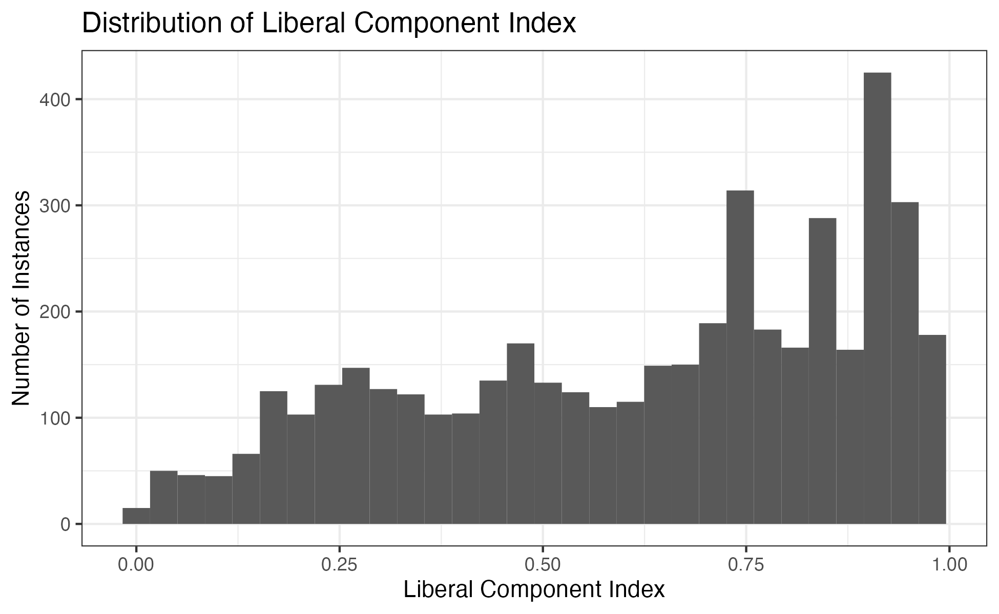

---
title: "Constitutions, States of Emergency, and Liberality"
output:
  pdf_document: default
  html_document: default
date: "2022-10-30"
---

## Introduction:
How does giving the government constitutional authority to suspend or restrict rights during a state of emergency affect liberality? Intuitively, granting the government powers to suspend or restrict rights should make political conditions less liberal and more repressive. Does cross national data sustain this intuition? 

This question is important. States of emergency are often used to as an excuse to repress citizens and expand their powers, which has created critics of the practice from across the political spectrum (The Economist and Mator). These concerns are particularly salient as many governments declared prolonged states of emergency to help combat COVID-19 (Nardi). Analyzing data on constitutional provisions on states of emergency and liberality can help us rationally legitimize or delegitimatize these concerns. The results of this analysis also have interesting implications for constitutional design; if a constitution writer cares about liberality, how should they address states of emergency?


## Data Discussion:
My independent variable that measures constitutional data on states of emergency comes from the Comparative Constitutions Project, which aims to “to record the characteristics of national constitutions” (CCP Codebook 4). The variables I used were “Does the constitution have provisions for calling a state of emergency?” (`em`) and “Does the constitution provide for suspension or restriction of rights during states of emergency” (`emrights`) (Elkins and Ginsburg 48). I excluded the few values that were coded as “other” to measure the causal effects of including the clause more effectively. I lumped together cases where `em` was “No Provision” and `emrights` was “No Suspension” to create a variable (`emrights_recode`) that measures if a constitution has a provision suspending or restricting rights regardless of whether the constitution mentions states of emergency. If a constitution does not mention states of emergency, it is coded as “No Suspension”

My dependent variable on liberality comes from the V-Dem dataset which aims to “provide a multidimensional and disaggregated dataset that reflects the complexity of the concept of democracy as a system of rule that goes beyond the simple presence of elections.” (V-Dem). This variable is called “Liberal Component Index”, coded as `v2x_liberal`, measures the “extent” to which “the liberal principle of democracy is achieved” (Lindberg et. al 49). It is coded from 0 (completely illiberal) to 1 (completely liberal) (Lindberg et. al 49). This variable aggregates measures such as “equality before the law and individual liberates” and “judicial [and] legislative constraints on the executive” (V-Dem Codebook 49). Data is collected by surveying and averaging the opinions of at least five academics or professionals that focus on a particular country. At least two-thirds of them are nationals of the countries they cover (V-Dem). For the control variable (geographic region), V-Dem takes data from the Quality of Government Standard Dataset to sort countries into six politically meaningful geographical bins (Lindberg et. al 361).

All data in this analysis is from the Post-Cold War (after 1991) to ensure that findings are relevant to the modern day and to prevent R from overloading my CPU.


```{r, include = FALSE}
library(tidyverse)
library(dplyr)
library(infer)
library(stringr)
library(broom)

```


```{r, include = FALSE}
#Loading the constitution dataset
constitution <- read_csv("ccpcnc_v4_small.csv")
```


```{r, include = FALSE}
#selecting variables
constitution <- constitution |>
  drop_na(em) |>
  select(country, year, em, emrights) |>
  filter(year > "1991")
```


```{r, include = FALSE}
#Loading V-Dem Dataset
liberal <- read_csv("V-Dem_v3.csv")
```


```{r, include = FALSE}
#Selecting variables
liberal <- liberal |>
  select(country_name, year, v2x_liberal, e_regionpol_6C, e_gdppc) |> 
  filter(year > "1991")
```


```{r, include = FALSE}
#Renaming variables to match the constitution dataset
liberal <- liberal |>
  rename(country = country_name)
```


```{r, include = FALSE}
#Using Stingr Package to standardize country names so they do not get dropped when the datasets merge:
library(tidyverse)
library(dplyr)
library(stringr)
liberal <- liberal |>
  mutate(across('country', str_replace, 'Burma/Myanmar', 'Myanmar'),
         across('country', str_replace, 'The Gambia', 'Gambia'),
         across('country', str_replace, 'Republic of the Congo', 'Congo'))
```


```{r, include = FALSE}
#Filtering out duplicate data in `constitution`
##This filters out all Serbia data, why isn't the "and" function (&) not working
constitution <- constitution |>
  filter(country != "Serbia" & year != "2006")  

```


```{r, include = FALSE}
#Joining the datasets together
joined <- constitution |>
  left_join(liberal) |>
  select(country, year, v2x_liberal, e_gdppc, em, emrights, e_regionpol_6C) 
```


```{r, include = FALSE}
#Mutating `e_regionpol_6C` to give it descriptive region names.
joined <- joined |>
  mutate(e_regionpol_6C = case_when(
    e_regionpol_6C == 1 ~ "Eastern Europe + Central Asia",
    e_regionpol_6C == 2 ~ "Latin America + Caribbean",
    e_regionpol_6C == 3 ~ "MENA",
    e_regionpol_6C == 4 ~ "Sub-Saharan Africa",
    e_regionpol_6C == 5 ~ "Western Europe + North America",
    e_regionpol_6C == 6 ~ "Asia + Pacific",
    em == 97 ~ "unknown")
  )
```


```{r, include = FALSE}
#Mutating `e_regionpol_6C` to give it descriptive region names.
joined <- joined |>
  mutate(em = case_when(
    em == 1 ~ "Provision",
    em == 2 ~ "No Provision",
    em == 96 ~ "Other",
    em == 97 ~ "Unknown")
      )
  #filter(em == c("Provision", "No Provision"))
  #mutate(across('country', str_replace, 'other', '')) #neither of these actually get rid of the other
  #mutate(str_remove(emrights, "other"))

```


```{r, include = FALSE}
#Mutating Provision on State of Emergency Variable (emrights)
joined <- joined |>
    mutate(emrights = case_when(
    emrights == 1 ~ "Suspension",
    emrights == 2 ~ "No Suspension",
    emrights == 96 ~ "Other",
    emrights == 97 ~ "unknown")) 
```


```{r, include = FALSE}
#Creating `emrights_recode` Variable
new_joined <- joined |> 
  mutate(emrights_recode = if_else(is.na(emrights), "No Suspension", emrights)) |> 
  filter(em != "Other" & emrights_recode != "Other")
```


## Plot Summarizing the Dependent Variable


```{r, include = FALSE}
dependent_plot <- joined |>
  ggplot(aes(x = v2x_liberal)) +
  geom_histogram() +
  labs(title = "Distribution of Liberal Component Index",
       x = "Liberal Component Index",
       y = "Number of Instances") +
  theme_bw()
ggsave("dependent_plot.png", dependent_plot)
```




## Regression Table:


```{r, include = FALSE}
library(modelsummary)
suspension_multi_lm <- lm(v2x_liberal ~ emrights_recode + e_regionpol_6C, data = new_joined)
```

```{r, echo = FALSE}
modelsummary::modelsummary(suspension_multi_lm,
                           statistic = c("s.e. = {std.error}",
                                         "p = {p.value}"),
                           gof_map = c("nobs", "r.squared", "adj.r.squared"))
```


## Results
Controlled for geographic region, countries with constitutions that allow for the suspension or restriction of rights during states of emergency are on average 8.6 percent more liberal. These results seem statistically significant as the p-value of `emrights_recode` is less than 0.001. This p-value means that given the data, the measured change in the `v2x_liberal` value had less than a 0.1 percent chance of being due to random chance. To calculate statistical significance, I assume that country-year `v2x_liberal` values are statistically independent. To do otherwise would be outside the scope of the class.


## Conclusion
Controlled for geographical region, there is a positive relationship between constitutional permission to suspend or restrict rights during state of emergencies and liberality. Its inclusion is linked with an 8.6 percent increase in liberality. Yet it is hard to determine the correct causal chain. These results imply that constitutions that allow for the restriction of rights during states of emergency create more liberal conditions. But the reverse could be true. Liberal conditions promote free debate and discussion. This dialogue may lead to better constitutional design where flexibility in the face of emergency is considered. These results may also be incomplete due to missing data and errors. For instance, the V-Dem dataset includes no data about the United States, small island nations such as Micronesia and Saint Lucia, or small city-state nations such as Monaco or Andorra. Additionally, due to data duplication errors, Serbia was dropped from the dataset. In the future, these results should be controlled with more variables. I tested GDP per capita, which yielded stronger constitutional correlations, but due to missing data, they decreased the sample size greatly and were thus not included. In the future, a project should take advantage of V-Dem’s database of years in which state of emergency were declared to create a before-and-after research design to better understand the causal effect of states of emergency on liberality.  


## Works Cited

Mator, A. (2020). COVID-19: The Road to Tyranny is Paved with Pandemics. The Imaginative Conservative. https://theimaginativeconservative.org/2020/04/covid-19-road-tyranny-pandemics-anthony-mator.html
	
A New Low for Global Democracy. (2022). The Economist. https://www.economist.com/graphic-detail/2022/02/09/a-new-low-for-global-democracy 	

Nardi, F. (2021). It’s Time to Reconsider State of Emergency Declarations for Sustained Crises. Georgetown Law. 	

The V-Dem Project.  The V-Dem Institute. https://www.v-dem.net/about/v-dem-project/
	
Lindberg et. al. (2016). V-Dem Codebook v12. 	

Elkins, Z. and Ginsburg, T. (2022). Characteristics of National Constitutions. 	


